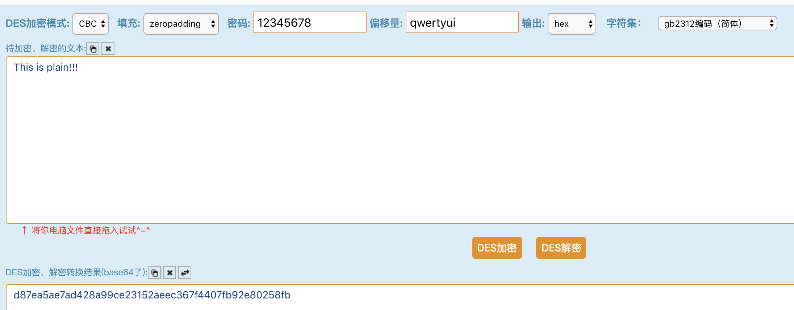

# DES加解密

探究思路：
深入理解DES单次加解密的代码

深入理解模式的代码实现，ECB，CBC这两种必须要进行了解

文章写的不好可以不投，但是学习是自己的事情，必须重视起来。

第一篇 DES介绍 从二进制程序  特点  原理介绍-简略

第二篇 加密模式

第三篇 DES变形
## python

### pycrypto

#### CBC模式

```
>>> iv = 'qwertyui'
>>> key = '12345678'
>>> cipher = DES.new(key,DES.MODE_CBC,iv)
>>> plain = 'This is plain!!!'
>>> ciphertext = cipher.encrypt(plain
>>> ciphertext
'\xd8~\xa5\xaez\xd4(\xa9\x9c\xe21R\xae\xec6\x7f'
>>> len(ciphertext)
16
```
#### ECB模式


感觉不太准确

## C


## 在线

http://tool.chacuo.net/cryptaes

支持加密模式，填充，数据块大小，IV向量的选择



16位的明文加密之后居然成24位的？？不过前16位是正确的

在线网站除了ECB模式的结构可以相信之外其他模式的结果还是用代码算。


http://aes.online-domain-tools.com/

国外的网站，IV向量仅仅支持hex

由于DES加密后的结果不一定是可打印字符，因此在线加解密的网站通常将结果变成base64编码。所以，，结果不可信呐！！！

# 总结

加解密用代码来实现，而不要图一时之快，在线加解密都是假的。