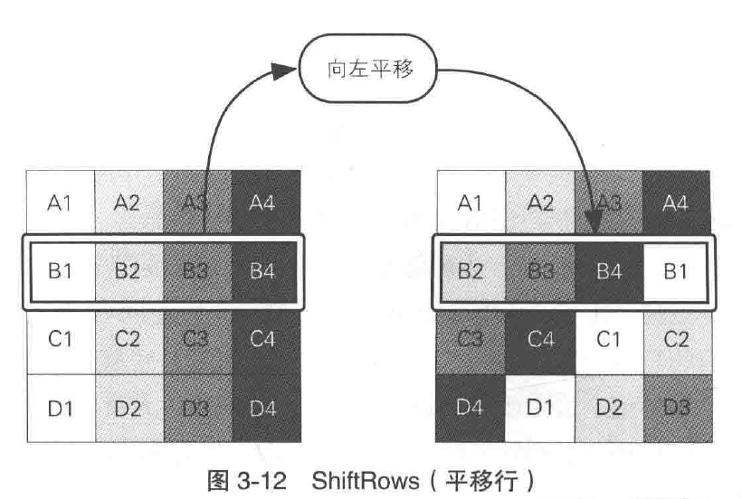
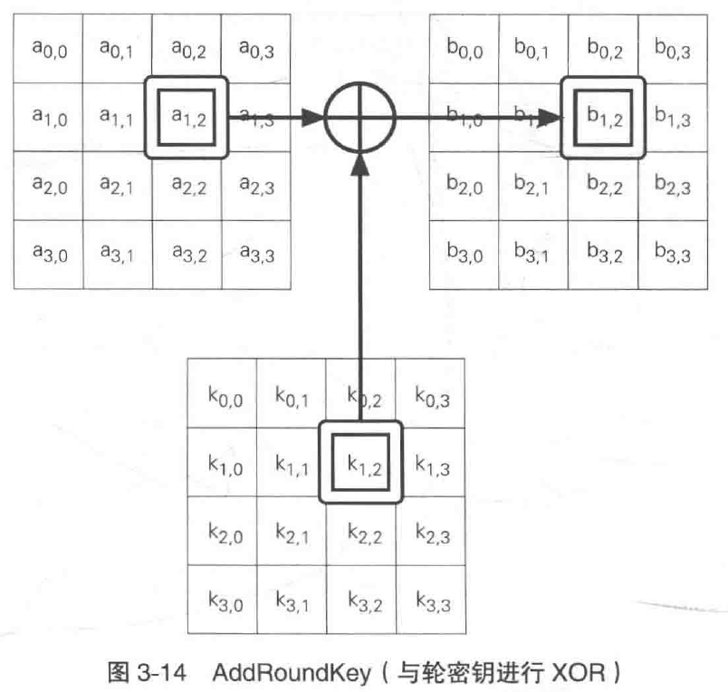

# 密码学笔记

什么才算得上是专业

满足三个条件：

1. 长期从事相关的研究，至少10年以上吧
2. 实时跟进该专业领域的最新动态
3. 在专业领域，有联系交流的人

# 图解密码技术

之前应该也做过相关笔记，可能是忘记存下来了

### 对称密码与公钥密码

对称密码：加解密使用同一个密钥的方式

公钥密码：加解密使用不同密钥的方式，也称非对称密码

混合密码系统：对称密码+公钥密码

## 其他密码技术

### 单向散列函数hash

单向散列函数所保证的并不是机密性，而是完整性。

完整性是指：“数据是正牌的而不是伪造的”

### 消息认证码

不仅保证完整性还能提供**认证**机制

### 数字签名

防止**伪装**，**篡改**，**否认**

### 伪随机数生成器

PRNG（Pseudo Random Number Generator）

>之前看到过这样一个句子：密码是最反人类的发明

## 密码与信息安全常识

1. 不要使用保密的密码算法	
2. 使用低强度的密码比不进行任何加密更危险
3. 任何密码总有一天都会被破解
4. 密码只是信息安全的一部分

# 历史上的密码
只列目录，不进行说明

## 凯撒密码

## 简单替换密码
## Enigma

# 对称密码

### XOR

异或

### 一次性密码本-绝对不会被破译的密码

因为存在多解，就是这样。

但是密钥无法进行传送。因此无法拿来应用

## DES

DES（Data Encryption Standard），一直以来被美国以及其他国家的政府和银行等广泛使用

但是目前的暴力破解能力，可以在一天的时间内将DES破解，硬刺除了用它来解密以前的密文以外，现在不应该使用DES了

### 加密与解密

DES是一种将64比特的明文加密成64比特的密文的对称密码算法，他的密钥长度是56比特。但从严格来说，DES的密钥长度是64比特，但由于每隔7比特会设置一个用于错误检查的比特，因此实质上起密钥成都市56比特

DES是以64比特的明文为一个单位来进行加密的。
这一个单位称为分组，一般来说以分组为单位进行处理的密码算法称为分组密码。

DES每次只能加密64bit的数据，如果要加密的明文比较长，就需要对DES加密进行迭代，而迭代的具体方式，就称为模式

### DES的结构

也称为 Feistel网络

在**Feistel网络**中，加密的各个步骤称为**轮**，整个加密过程就是进行若干次轮的循环

每一轮都需要使用一个不同的子密钥

轮函数的作用是根据右侧和子密钥生成对左侧进行加密的比特序列，它是密码系统的核心。

一轮的具体计算步骤：

1. 将输入的数据等分为左右两部分
2. 将输入的右侧直接发送到输出的右侧
3. 将输入的右侧发送到轮函数
4. 轮函数根据右侧数据和子密钥，计算出一串看上去是随机的比特序列
5. 将上一步得到的比特序列与左侧数据进行xor运算，并将结果作为加密后的左侧

但是这样右侧的数据根本就没有加密，因此我们需要用不同的子密钥对一轮处理重复若干次，并在每次处理之间将左侧和右侧的数据对调。

如下图：

Feistel的解密操作之遥按照相反的顺序来使用子密钥就可以了。也就说用相同的子密钥重新进行一次Feistel轮就可以了

总结一下Feistel网络的性质：

轮数可以任意增加
加密时无论使用任何函数作为轮函数都可以正确解密，也就是说轮函数可以被设计的任意复杂。

另外加密和解密可以用完全相同的结构来实现。

## 三重DES

三重DES是为了增加DES的强度，将DES重复3次所得到的一种密码算法。也称为TDEA，通常缩写为3DES

加密-》解密-〉加密

## AES

AES是取代DES尔称为新标准的一种对称密码算法，最终选了一种名为Rijndael的对称密码算法，并将其确定为AES

### Rijndael的加密和解密

其中每一轮分为 SubBytes ShiftRows MixColumns 和AddRoundKey 共四个步骤

Rijndael 使用SPN结构
Rijndael 的 输入分组为128bit，也就是16字节，需要逐个字节的对16字节的输入数据进行SubBytes处理。

**SubBytes**：就是以每隔字节的值为索引，从一张拥有256个值的替换表（S——Box）中查找对应值的处理，也就说，要将一个字节的值替换成另一个字节的值

**SubBytes**之后需要进行**ShiftRows**处理，这一步将以4字节为单位的行按照一定的规则axing左平移，且每一行平移的字节数是不同的。

而后进行**MixColumns**处理。

这一步是对一个4字节的值进行比特运算，将其变为另外一个4字节值。

最后需要将**MixColumns**的输出与轮密钥进行XOR，即进行**AddRoundKey**处理。

到这里**Rijndael**的一轮就结束了，实际上，在Rijndael中需要重复进行10-14轮计算

通过上面可以发现，输入的所有比特在一轮中都会被加密
 
加密过程：
SubBytes->ShiftRows->MixColumns->AddROundKey

解密过程：
AddRoundKeys->InvMixColumns->InvShiftRows->InvSubBytes

# 分组密码的模式

我比较陌生和疑惑的地方

### 分组密码与流密码

密码算法可以分为分组密码和流密码两种：

分组密码：是每次只能处理特定长度的一块数据的一类密码算法。这里的一块就称为分组。一个分组的比特数就称为分组长度。

流密码：是对数据流进行连续处理的一类密码算法。流密码中一般以1bit】8bit或32bits等单位进行加密和解密

分组密码处理完一个分组就结束了，因此不需要通过内部状态来记录加密的进度：相对的，流密码是对一串数据流进行连续处理，因此需要保持内部好状态。

### 什么事模式

分组密码算法只能加密固定长度的分组，但是我们需要加密的明文长度可能会超过分组密码的分组长度，这时就需要对分组密码算法进行迭代，以便将一段哼唱的明文全部加密。而迭代的方法就称为分组密码的模式。。

将明文分割成多个分组并逐个加密的方法称为ECB模式，这种模式就有很大的弱点。对密码不是很了解的程序猿在编写加密软件时经常会使用ECB模式，但这样做会在不经意间产生安全漏洞。因此千万不要使用ECB模式。

分组密码的模式主要分以下5种：

1. ECB模式：电子密码本模式
2. CBC模式：密码分组链接模式
3. CFB模式：密文反馈模式
4. OFB模式：输出反馈模式
5. CTR模式：计数器模式

### 明文分组和密文分组

**明文分组**是指分组密码算法中作为加密对象的明文。明文分组的长度与分组密码算法的分组长度是相等的。

**密文分组**是指使用分组密码算法将明文分组加密之后所生成的密文

## ECB模式

电子密码本模式

在ECB模式汇总，将明文分组加密之后的结果将直接称为密文分组。

### ECB特点

最简单的一种，明文分组和密文分组是一一对应的关系，因此，如果明文中存在多个相同的明文分组，则这些明文分组最终将被转换为相同的密文分组。这样以来之遥观察一下密文，就可以知道明文中存在怎样的重复组合，并可以以此为线索来破译密码，因此ECB模式存在一定的风险。

ECB模式一大弱点就是可以在不破译密文的情况下操纵明文。

## CBC模式

CBC模式全程：密文分组链接模式

在CBC模式中，首先将明文分组与前一个密文分组进行XOR运算，然后再进行加密

### 初始化向量

当加密第一个明文分组时，由于不存在前一个密文分组，因此需要事先准备一个长度为一个分组的比特序列来代替前一个密文分组，这个比特序列称为初始化向量。通常缩写为 IV

一般来说，每次加密时都会产生一个不同的比特序列作为初始化向量。

### CBC模式的特点

明文分组在加密前一定会与前一个密文分组进行XOR运算，因此即使明文分组1和明文分组2的值是相等的，密文分组1和2的值也不一定相等。

在CBC模式中，我们无法单独对一个中间明文分组进行加密，

解密时，如果一个分组损坏了，在这种情况下，只要密文分组的长度没有发生变化，则解密时最逗只会有2个分组收到数据损坏的影响

假设CBC模式的密文分组中有一些bit确实了，那么此时即便只缺失了一bit，也会导致密文分组的长度发生变化，此后的分组发生错位，这样以来缺失的比特的位置之后的密文就全部无法解密了。

### 一些攻击方法

不做研究了解一下呗

填充提示攻击

对初始化向量进行攻击

## CFB模式

CFB模式全程 密文反馈模式。在CFB模式中，前一个密文分组会被送回道密码算法的输入端。

在ECB模式和CBC模式中。明文分组都是通过密码算法进行加密的，然而，在CFB模式中，明文分组并没有通过密码算法来直接进行加密。

### CFB模式与流密码

对比一下：

一次性密码本是将明文与随机比特序列进行XOR运算来生成密文的。

CFB模式通过将明文分组与密码算法的输出进行XOR运算生成密文分组

CFB模式中由密码算法生成的比特序列称为密钥流。在CFB模式中，密码算法就相当于用来生成密钥流的伪随机生成器，而初始化向量就相当于是伪随机数生成器的种子。

在CFB模式中，明文数据可以被逐比特加密，因此可以将CFB模式看作是一种使用分组密码来实现的流密码的方式。

### 攻击方式

重访攻击

## OFB模式

OFB模式全程。输出反馈模式。在OFB模式中，密码算法的输出会反馈到密码算法的输入中。

OFB模式并不是通过密码算法对明文直接进行加密的，而是痛殴将明文分组和密码算法的输出进行XOR来产生密文分组的。

### CFB模式与OFB模式的对比

OFB模式和CFB模式的区别仅仅在于密码算法的输入

CFB模式中，密码算法的输入是前一个密文分组，也即是将密文分组反馈懂啊密码算法中。

OFB中，密码算法的输入是前一个密码算法的输出。也就是将输出反馈给密码算法，因此也就有了输出反馈模式

CFB模式，必须从第一个明文分组开始按顺序进行加密，

OFB模式可以事先准备好密钥流。

这就意味着，密钥流的操作和进行XOR运算的操作是可以并行的。。

## CTR模式

CTR模式的全程是 计数器模式，CTR模式是一种通过将逐次累加的计数器进行加密来生成密钥流的流密码。

CTR模式中，每隔分组对应一个逐次累加的计数器，听通过计数器进行加密来生成密钥流。也就是说，最终的密文分组是通过将计数器加密得倒的比特序列，与明文分组进行XOR而得到的。

### 计数器的生成方法

每次加密时都会生成一个不同的值来作为计数器的初始值。当分组长度为128比特时，计数器的初始值可能像这样

### OFB和CTR模式的比较

CTR和OFB模式一样，都属于流密码。

### CTR模式的特点

CTR模式的加解密使用了完全相同的结构。

CTR模式中可以以仁义顺序对分组进行加密和解密，因此在加密和解密时需要用到的计数器的值可以由nonce和分组序号直接计算出来。

因此可以以任意顺序处理分组。而不仅仅是可以支持并行。

## 应该使用那种模式

# 公钥密码

用公钥加密，用私钥解密。

## 密钥配送问题

这个问题很难从根本上得到解决。

只有将密文连同密钥一起发给别人，别人才能接受，那么如何保证密钥的安全性呢？

密钥必须要发送，但又不能发送，这就是对称密码的密钥配送问题

通常解决密钥配送问题的方法有以下几种：

1. 通过事先共享密钥来解决
2. 通过密钥分配中心来解决
3. 通过Diffie-Hellman密钥交换来解决
4. 通过公钥密码来解决

### 通过事先共享密钥来解决

密钥配送问题最简单的一种解决办法。就是事先用安全的方式将密钥交给对方。

但这存在一定的局限性

### 通过密钥分配中心来解决

如果所有参加通信的人都需要事先通过共享密钥，则密钥的数量会变得巨大，这样的情况下，我们可以使用密钥分配中心（KDC）。

### 通过Diffie-Hellman密钥交换来解决

这里的交换并不是指东西坏了需要换一个，而是指发送者和接受着之间互相传递信息的意思。

在Diffie-Hellman密钥交换中，进行加密通信的双方需要交换一些信息，而这些信息即便被窃听者Eve窃听到也没有问题。

根据交换的信息，双方可以各自生成像同的密钥，而窃听者无法生成像同的密钥。

### 通过公钥密码来解决

接收者事先将加密密钥发送给发送着，这个加密密钥即便被窃听也没有问题，发送着使用加密密钥对通信内容进行加密而发送个接受着，而只有拥有这个解密密钥的人才能够进行解密。

因此在这个过程中，解密密钥也就是私钥，并没有传输。

## 公钥密码

### 什么事公钥密码

密钥分为加密密钥和解密密钥两种。

发送着用加密密钥对消息进行加密，接收者用解密密钥对密文进行解密。要理解公钥密码，要清楚的区分加密密钥和解密密钥事非常重要的。加密密钥事发送着加密时使用的。而解密密钥是接收者解密时使用的。

区别：

1. 发送着只需要加密密钥
2. 接收者只需要使用解密密钥
3. 解密密钥不可以被窃听者获取
4. 加密密钥被窃听者获取也没有问题

公钥和私钥是一一对应的。一对公钥和私钥统称为密钥对（key pair）

由公钥进行加密的密文，必须使用与该公钥配对的私钥才能解密。

密钥对中的两个密钥之间具有非常密切的关系-数学上的关系-因此公钥和私钥是不可以单独生成的。

### 公钥密码的历史

### 公钥通信的流程

公钥密码通信中，通信过程是有接收者来启动的

### 公钥密码无法解决的问题

公钥密码解决了密钥配送问题，但这并不意味着它能够解决所有的问题，因为我们需要判断所得到的公钥是否正确合法。这个问题被称为公钥认证问题。

另外公钥密码的处理速度只有对称密码的几百分之一

## 时钟运算

### 加法

略

## RSA
### 什么事RSA

RSA是一种公钥密码算法，可以被用于公钥密码和数字签名

### RSA加密

E和N事RSA加密的密钥，也就是说E（E，N）的组合就是公钥

### RSA解密

（D，N）的组合就是私钥

### 生成密钥对

RSA加解密需要E、D、N三个数，那么这个三数如何生成呢

RSA密钥对的生成步骤：

1. 求N
2. 求L（L事仅在生成密钥对的过程中使用的数）
3. 求E
4. 求D

### 具体实践

RSA利用了质因数分解的苦难度

## 对RSA的攻击

## 其他公钥密码

### EIGamal方式

EIGamal利用了mod N 下求离散对数的困难度

不过该种方式有一个缺点，就是经过加密的密文长度会变成明文的两倍。

### Rabin方式

Rabin方式利用了 求平方根的困难度

### 椭圆曲线密码

ECC 事最近备受关注的一种公钥密码算法。他的特点是所需要的密钥长度比RSA短

椭圆曲线密码是通过椭圆曲线上的特定点进行特殊的乘法运算来实现的，它利用了这种乘法运算的逆运算是非常困难的这一特性。

# 混合密码系统

### 混合密码系统

组成机制：

1. 用对称密码加密消息
2. 痛殴伪随机数生成器生成对称密码加密中使用的绘画密钥
3. 用公钥密码加密绘画密钥
4. 从混合密码系统外部赋予公钥密码加密时使用的密钥

解密过程：

# 单向散列函数

根据消息的内容计算出散列值

### 特性

单向性

### 术语

单向散列函数也称为消息摘要函数、哈希函数或者杂凑函数

输入单向散列函数的消息也称为原像

单向散列函数输出的散列值也称为消息摘要或者指纹

## 单向散列函数的实际应用

### 检测软件是否被篡改

### 基于口令的加密

### 消息认证码

### 数字签名

### 伪随机数生成器

### 一次性口令

## 具体例子

### MD4、MD5

### SHA-1、SHA-256、SHA-384、SHA-512

略。。

# 消息认证码

确认完整性并进行认证的技术

# 数字签名

消息认证码无法防止否认

数字签名能解决这个问题

# 证书

略

# 密钥-秘密的精华

## 密钥的管理

### 生成密钥

用随机数生成密钥

用口令生成密钥

### 配送密钥

之前有提到

### 更新密钥

用当前密钥的散列值作为下一个密钥

### 保存密钥

人类无法记住密钥

对密钥进行加密的意思

用来加密密钥的密钥称为 KEK
可以减少密钥的管理，就像层次分级一样，我们只需要管理最高层的密钥即可。

# 随机数

## 随机数的性质

要给随机数下一个严密的定义是非常困难的，有时甚至会进入哲学争论的范畴。

### 分类

1. 随机性
2. 不可预测性
3. 不可重现性

### 随机性

所谓随机性，就是杂乱无章的性质。

### 不可预测性

所谓不可预测性，是指攻击者在知道过去生成的伪随机数列的前提下，依然无法预测出下一个生成的伪随机数的性质。

那么如何才能编写出具备不可预测性的伪随机数生成器呢？

其实不可预测性是通过使用其他的密码技术来实现的。

具体内容见下文

### 不可重现性

所谓不可重现性：是指无法重现和某一随机数列完全相同的数列的性质，如果说出了将随机数本身保存下来，没有其他办法能够重现该数列，那么就说该随机数是不可重现的。

仅靠软件时无法生成出具备该性质的随机数列的。

要生成不可重现的随机数列，需要从不可重现的物理现象中获取信息。

目前，英特尔的新型CPU中国呢就内置了数字随机数生成器，并提供了生成不可重现的随机数的RDSEED指令，以及生成不可预测的随机数的RDRAND指令

## 伪随机数生成器

内部状态：

将根据内部状态计算伪随机数的方法和改变内部状态的方法组合起来，就是伪随机数生成的算法。

伪随机数生成器的种子：

伪随机数生成器时公开的，但是种子是保密的

## 具体的伪随机数生成器

###  杂乱的方法

### 线性同余法

### 单向散列函数法

### 密码发

### ANSIX9.17

## 对伪随机数生成器的攻击

# PGP-密码技术的完美组合

PGP具备现代密码软件所必需的几乎全部功能

# SSL/TLS-为了更安全的通信

# 密码技术与现实社会

密码学家的工具箱

## 虚拟货币-比特币

BTC

用户通过钱包生成密钥对，并据此在互联网上进行交易，其中，公钥用于接收比特币，而私钥用于支付比特币。私钥保存在钱包中。

### 区块链

BTC中最重要的一个概念

简单来说区块链就是保存BTC全部交易记录的公用账簿

### 量子密码

基于量子理论的通信技术

两个事情：

1. 从原理上说，无法准确测出光子的偏正方向
2. 测量行为本身会导致光子的状态发生改变

## 只有完美的密码，没有完美的人

在确保系统的整体安全方面，人是一个巨大的弱点。

Over！

